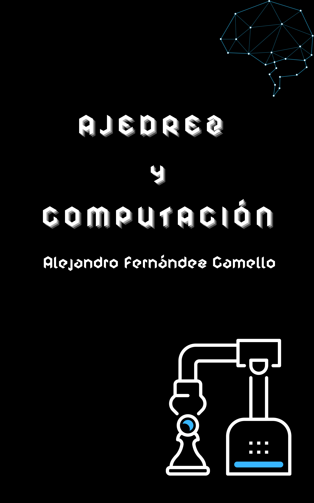

<p align="center">
  
</p>

<h1 align="center">♟️ Ajedrez y Computación</h1>

<p align="center">
  <strong>A visual introduction to algorithms, artificial intelligence, and chess.</strong>
</p>

<p align="center">
  A bilingual web edition of <em>Ajedrez y Computación / Chess and Computation</em>,<br />
  written by Alejandro Fernández Camello.
</p>

<p align="center">
  <a href="https://chess-and-computation.alejandrofernandezcamello.me">🌐 Read online</a>
  ·
  <a href="https://www.amazon.es/Ajedrez-Computación-movimientos-revolución-ajedrez/dp/B0CNCT6DZ1">📕 Buy on Amazon</a>
</p>

## 📖 About the book

How does a machine learn to play chess? This project explores the ideas that made computer chess possible, from classic combinatorial problems and search algorithms to reinforcement learning, neural networks, and systems such as AlphaZero.

The content is written for curious readers: you do not need to be a programming specialist or an expert chess player to follow along.

## ✨ What the web edition includes

- 🇪🇸 🇬🇧 Complete Spanish and English editions.
- 🧭 Chapter navigation, search, and reading progress.
- ♞ Chess diagrams and interactive figures.
- 🧮 Mathematical notation rendered with KaTeX.
- 🌙 Light and dark themes.
- 📱 An accessible, responsive design for mobile, tablet, and desktop.
- 🔎 SEO metadata, Open Graph, JSON-LD, and a sitemap.

## 🛒 Get the book

The book available on Amazon is in Spanish only:

### [📕 Buy *Ajedrez y Computación* on Amazon Spain](https://www.amazon.es/Ajedrez-Computación-movimientos-revolución-ajedrez/dp/B0CNCT6DZ1)

You can also [read the bilingual web edition for free](https://chess-and-computation.alejandrofernandezcamello.me).

## 🚀 Local development

The site is built with [Astro](https://astro.build/) and uses [Bun](https://bun.sh/) as its package manager and runtime.

```sh
git clone https://github.com/alexfdez1010/chess-and-computation.git
cd chess-and-computation
bun install --frozen-lockfile
bun run dev
```

The development server will print the local URL in the terminal.

## 🧰 Commands

| Command | Description |
| --- | --- |
| `bun run dev` | Start the development server. |
| `bun run check` | Check Astro files and types. |
| `bun run build` | Validate and generate the production site. |
| `bun run qa` | Build and run the complete site verification suite. |
| `bun run preview` | Serve the production build locally. |

## 🏗️ Content and architecture

The build generates Spanish and English reading routes, localized diagrams, equations, static assets, and site metadata. The production URL is configured in Astro as `https://chess-and-computation.alejandrofernandezcamello.me`, so no environment variable is required.

The original LaTeX content is used from `tmp/source/AC` during conversion. To regenerate the Markdown files:

```sh
bun scripts/convert-latex-content.mjs
```

Book assets and generated SVG boards have additional verification scripts in `scripts/`.

## 🎨 Design

See the [design system](docs/DESIGN_SYSTEM.md) for the project's visual, accessibility, localization, and content guidelines.

---

<p align="center">
  Made with ♟️, code, and curiosity by <strong>Alejandro Fernández Camello</strong>.
</p>
